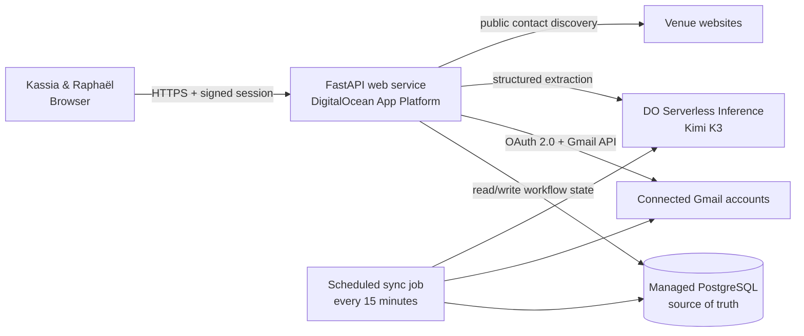

<div align="center">

# Wedding Venue Control Center

**A private, working venue-search workspace for Kassia & Raphaël.**

[Live app](https://rkwedding-az2zo.ondigitalocean.app) · [Product brief](docs/PRODUCT_BRIEF.md) · [Health check](https://rkwedding-az2zo.ondigitalocean.app/health) · [Detailed architecture](docs/ARCHITECTURE.md)


</div>

## What exists today

The app supports the real venue workflow end to end:

```text
Paste website → Review contact → Review and send inquiry → Track thread
      → Receive reply → Generate English synthesis and price estimate → Reply
```

- Discover a venue name, address, region, email, website, and phone from its public website.
- Preview every initial inquiry before explicitly sending it.
- Send new inquiries from the configured shared wedding Gmail account.
- Track correspondence across both connected Gmail accounts without merging identities.
- Poll Gmail automatically every 15 minutes and reconcile messages idempotently.
- Show the saved PostgreSQL venue list immediately; the browser refreshes that view every minute.
- Summarize Italian replies in English with Kimi through DigitalOcean Serverless Inference.
- Extract structured status and estimated pricing for 90 guests.
- Preview, edit, and explicitly send follow-up replies in the original Gmail thread.
- Search and filter the tracking dashboard, or open the complete venue directory.
- Keep human research notes separate from official venue replies and quotes.
- Mirror Gmail attachments into one private Spaces bucket and show them beside
  the venue with short-lived **View** and **Open in Gmail** links.

## Runtime architecture



DigitalOcean App Platform runs stateless application containers. Durable venue data, Gmail OAuth tokens, messages, pricing, and sync checkpoints live in managed PostgreSQL. Container restarts and deployments do not erase application state.

See [docs/ARCHITECTURE.md](docs/ARCHITECTURE.md) for data ownership, sequence diagrams, security boundaries, and failure behavior.

## Sources of truth

| Data | Authoritative system | Notes |
|---|---|---|
| Venues and workflow state | PostgreSQL | Drives both app pages and all statuses. |
| OAuth tokens and account ownership | PostgreSQL | Never sent to the browser. |
| Full email threads | Gmail | PostgreSQL stores normalized copies needed for tracking and synthesis. |
| Venue research metadata | PostgreSQL | Entered and maintained through the application. |
| English summaries and price estimates | PostgreSQL | Derived by Kimi from stored inbound messages. |

## Product surfaces

| Route | Purpose |
|---|---|
| `/` | Outreach tracking, filters, venue onboarding, message previews, and replies. |
| `/venues` | Complete reference directory with contact, research, pricing, and activity details. |
| `/login` | Application-owned login that creates a seven-day signed HttpOnly session. |
| `/about` and `/privacy` | Public OAuth information pages. |
| `/health` | Public deployment health probe. |

## Gmail behavior

- New inquiries use the connected account named by `GOOGLE_PRIMARY_EMAIL`.
- Replies use the Gmail account that owns the original inbound thread.
- A new Gmail account can be connected only when its address is present in `GOOGLE_ALLOWED_EMAILS`.
- Refreshable OAuth credentials are stored in PostgreSQL and survive deployments.
- The scheduled worker checks all connected accounts every 15 minutes.
- Duplicate Gmail message IDs are ignored, making reconciliation safe to rerun.
- Sending always requires an explicit human click; the sync worker never sends email.

Google OAuth grants the app Gmail read/send access. Google Sheets and Pub/Sub are not part of the active production path.

## AI boundary

Kimi has one bounded responsibility: convert an inbound venue response into validated structured data:

- concise English summary;
- workflow status;
- minimum and maximum estimated total for 90 guests;
- short pricing-basis note.

Kimi does not send email, mutate OAuth credentials, select a venue, or control workflow state. FastAPI validates model output and owns every database write.

## Run locally

Requires Python 3.12.

```bash
git clone https://github.com/ralphieninefo/rkwedding.git
cd rkwedding

python3 -m venv .venv
source .venv/bin/activate
pip install -r requirements.txt

cp .env.example .env
uvicorn app.main:app --reload --env-file .env --port 8001
```

Open [http://127.0.0.1:8001](http://127.0.0.1:8001).

```bash
pytest -q
```

## Configuration

Keep local credentials in `.env`. Never commit `.env`, OAuth client JSON, refresh tokens, model keys, or the `data/` directory.

| Variable | Type | Purpose |
|---|---|---|
| `APP_ENV` | General | `local` by default; hosted runtime uses `production`. |
| `ALLOW_UNAUTHENTICATED_LOCAL` | General | Optional password-free local development only. |
| `DATABASE_URL` | Secret | SQLite locally; managed PostgreSQL is mandatory in production. |
| `CONTROL_CENTER_USERNAME` | General | Private dashboard username. |
| `CONTROL_CENTER_PASSWORD` | Secret | Signs in to the hosted dashboard and signs session cookies. |
| `CONTROL_CENTER_SESSION_TTL_HOURS` | General | Login lifetime; defaults to 168 hours. |
| `GOOGLE_CLIENT_SECRET_JSON` | Secret | Complete web OAuth client configuration in production. |
| `GOOGLE_ALLOWED_EMAILS` | General | Comma-separated Gmail accounts allowed to connect. |
| `GOOGLE_PRIMARY_EMAIL` | General | Connected account used for new inquiries. |
| `DIGITALOCEAN_MODEL_ACCESS_KEY` | Secret | Serverless Inference credential. |
| `DIGITALOCEAN_MODEL_ID` | General | Exact deployed model identifier. |
| `DIGITALOCEAN_INFERENCE_BASE_URL` | General | Serverless Inference API base URL. |
| `SPACES_BUCKET` | General | One private bucket containing every mirrored document. |
| `SPACES_REGION` | General | Spaces region; production uses `sfo2`. |
| `SPACES_ENDPOINT_URL` | General | Optional endpoint override; normally derived from the region. |
| `SPACES_ACCESS_KEY_ID` | Secret | Bucket-scoped Spaces access key ID. |
| `SPACES_SECRET_ACCESS_KEY` | Secret | Bucket-scoped Spaces secret. |
| `SPACES_PRESIGNED_URL_SECONDS` | General | Private view-link lifetime; defaults to 600 seconds. |

`DIGITALOCEAN_API_TOKEN` is an operator credential for `doctl`; the application does not use it at runtime.

## Repository map

```text
app/
├── main.py             HTTP routes, auth boundary, and UI entry points
├── database.py         PostgreSQL/SQLite models and dashboard projections
├── db_workflow.py      Sending, Gmail reconciliation, synthesis, and replies
├── discovery.py        Safe public website contact/address discovery
├── gmail.py            Gmail API client and message normalization
├── gmail_oauth.py      Multi-account OAuth and database-backed tokens
├── inference.py        Kimi structured English synthesis
├── session_auth.py     Signed control-center session cookies
├── scheduled_sync.py   App Platform scheduled worker entry point
├── storage.py          Private Spaces uploads and short-lived viewing URLs
├── documents.py        Embedded PDF-text extraction helper
└── static/             Login, tracking, and venue-directory interfaces

docs/ARCHITECTURE.md    Detailed current-state architecture
tests/                  API, workflow, OAuth, discovery, and scoring tests
.do/app.yaml            App Platform service, PostgreSQL, and scheduled job
```

## Deployment

The GitHub `main` branch deploys to DigitalOcean App Platform:

- one FastAPI web service;
- one managed PostgreSQL database binding;
- one scheduled `gmail-sync` job at App Platform's 15-minute minimum interval.
- one private Spaces bucket for Gmail attachments, addressed with
  `venues/{venue_id}/messages/{gmail_message_id}/attachments/...` prefixes.

See [`docs/SPACES_SETUP.md`](docs/SPACES_SETUP.md) for the production setup.

Runtime secrets are configured as encrypted App Platform variables. Blank secret values in `.do/app.yaml` are intentional placeholders and must never be replaced with committed credentials.

## Safety and current limitations

- Every initial inquiry and follow-up requires human review and an explicit send action.
- Full message bodies are excluded from dashboard API responses.
- Dashboard access and Gmail authorization are separate security decisions.
- Website discovery accepts public HTTP(S) targets only and blocks private network addresses.
- Attachments are mirrored for viewing, but their contents are not automatically
  sent to Kimi or OCR. Gmail remains authoritative for the original email.
- Gmail ingestion uses scheduled polling, so a reply may take up to 15 minutes to appear.
- Venue selection, contract acceptance, deposits, and calendar booking remain manual.

## Near-term roadmap

1. Add visible sync health and attachment-failure diagnostics without
   reintroducing a manual check requirement.
2. Optionally extract embedded PDF text for quote synthesis; keep OCR on demand.
3. Add shortlist and visit-planning views once quote data is sufficiently complete.
