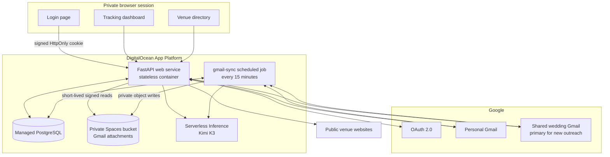
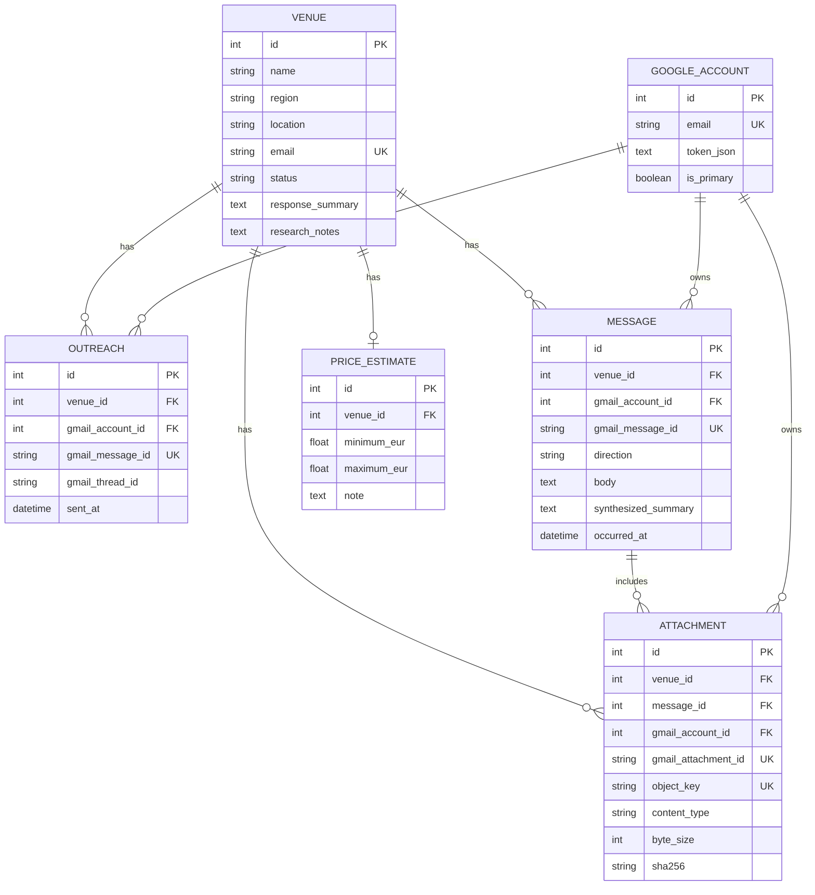
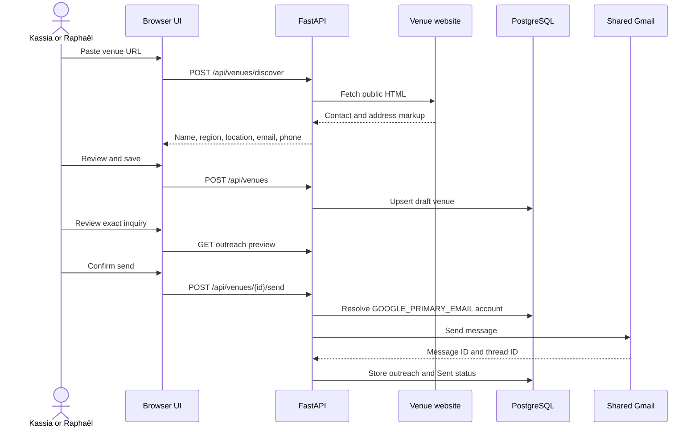
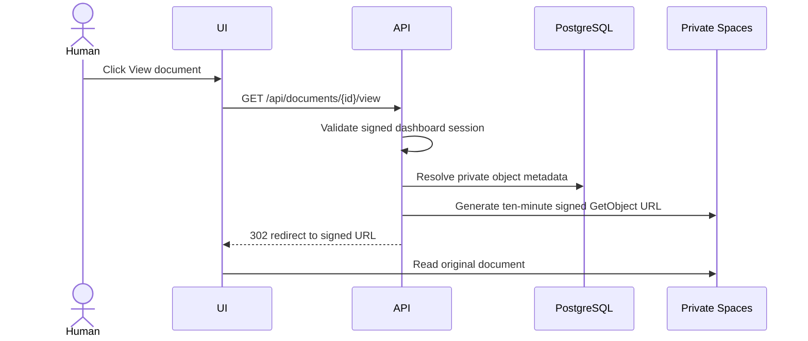
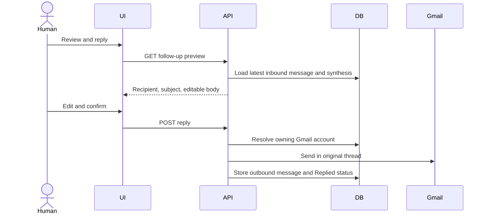

# Wedding Venue Control Center Architecture

Current production architecture as of September 3, 2026.

## 1. System intent

This is a private workflow application for finding a wedding venue. It is not a general autonomous agent and it is not a spreadsheet automation project.

The application handles four bounded jobs:

1. onboard venue contact information;
2. send reviewed Gmail outreach;
3. ingest and track replies;
4. turn replies into concise English decision data.

## 2. Production topology



### Deployment components

| Component | Runtime responsibility | Durable state? |
|---|---|:---:|
| `web` | UI, APIs, login, OAuth callbacks, contact discovery, preview/send actions | No |
| `gmail-sync` | Scheduled Gmail reconciliation, attachment mirroring, and reply synthesis | No |
| Managed PostgreSQL | Workflow records, normalized messages, OAuth tokens, estimates, checkpoints | Yes |
| Private Spaces bucket | Original Gmail attachment bytes mirrored for venue browsing | Yes |
| Serverless Inference | Stateless structured reply extraction | No |

App Platform containers are replaceable. No required production state lives in the container filesystem.

## 3. Data ownership



Additional `SystemState` records hold small checkpoints: `gmail_last_refresh`
(the last time at least one mailbox synchronized) and `gmail_sync_status`, a
JSON record of the last scheduled run with one entry per connected mailbox
(address, `ok`/`failed`, a short error sentence, last successful check, last
attempted check). It contains no tokens, message bodies, or object keys.

PostgreSQL is authoritative for the dashboard. Gmail remains authoritative for
complete conversation history and the original emailed attachment. Spaces is a
private, indexed mirror of attachment bytes for convenient viewing. Google
Sheets is not part of the production workflow.

## 4. Venue onboarding and initial outreach



Website discovery blocks credentials, non-HTTP schemes, private IP addresses, and redirect escapes. Sending is always a separate human-confirmed action.

## 5. Automatic reply ingestion

```mermaid
sequenceDiagram
    participant Cron as App Platform scheduler
    participant Job as gmail-sync
    participant DB as PostgreSQL
    participant Gmail as Gmail API
    participant Kimi as Kimi K3
    participant Spaces as Private Spaces
    participant UI as Dashboard

    Cron->>Job: Start every 15 minutes
    Job->>DB: Load connected Google accounts and venues
    loop Each connected Gmail account (independently)
        Job->>Gmail: Refresh token, search tracked addresses and known threads
        Gmail-->>Job: Normalized messages (or a per-mailbox failure)
        Job->>DB: Create new message or load known message
        Job->>Gmail: Download unmirrored attachments
        Job->>Spaces: Store private object under venue/message prefix
        Job->>DB: Store attachment metadata and checksum
        Job->>Kimi: Inbound subject/body only
        Kimi-->>Job: Validated English synthesis and estimate
        Job->>DB: Store message, status, summary, estimate
    end
    Job->>DB: Store per-mailbox sync status; advance refresh time if any mailbox succeeded
    UI->>DB: GET /api/venues on load and every minute
```

The dashboard does not need to trigger Gmail. It reads the last committed PostgreSQL state immediately. The maximum expected ingestion delay is the 15-minute scheduler interval plus processing time.

Mailboxes are reconciled independently. A revoked or expired refresh token,
a Gmail HTTP error, or an unreachable Google endpoint on one account is
recorded for that account only; the other account still synchronizes in the
same run. The dashboard reads `gmail_sync_status` and shows which mailbox needs
reconnecting (via **Add Gmail account**), while "Last automatic update" keeps
reflecting the most recent successful synchronization. Completing the OAuth
callback for that mailbox marks its entry `reconnected` immediately, so the
warning disappears before the next run confirms it. The job process exits
non-zero only when no mailbox could be checked at all, and the manual
`/api/control-center/sync` route answers 502 in that same situation.

Attachment mirroring is deliberately separate from new-message creation. The
worker revisits attachment references on known messages, allowing the first
Spaces-enabled deployment to backfill recent documents idempotently.

## 6. Private document viewing



There is one production bucket, not one bucket per venue. Keys use stable IDs:

```text
venues/{venue_id}/messages/{gmail_message_id}/attachments/
  {gmail_attachment_id}/{sanitized_filename}
```

The bucket is private. The database does not expose object keys through the
venue API, and the browser never receives a long-lived Spaces credential.

## 7. Follow-up replies

New outreach uses the configured primary shared account. A follow-up uses `gmail_account_id` from the inbound message so it stays in the account and thread that actually received the reply.



## 8. Authentication and credentials

### Dashboard authentication

- A normal login form accepts the control-center username and password.
- The password never enters the repository.
- Successful login creates an HMAC-signed, HttpOnly, Secure, SameSite=Lax cookie.
- The default session duration is seven days.
- Public routes are limited to login assets, OAuth information pages, health, and webhook paths.

### Google authorization

- Dashboard access does not grant permission to attach any Google account.
- OAuth callbacks identify the Gmail address before storing credentials.
- New addresses must be in `GOOGLE_ALLOWED_EMAILS`; existing accounts may reauthorize.
- Refreshable OAuth token JSON is stored in PostgreSQL.
- `GOOGLE_PRIMARY_EMAIL` selects the sender for new inquiries.

### Secret placement

| Secret | Stored in production | Browser exposure |
|---|---|:---:|
| Dashboard password | App Platform encrypted environment | Entered only at login |
| OAuth client secret | App Platform encrypted environment | No |
| Gmail refreshable tokens | PostgreSQL | No |
| Model access key | App Platform encrypted environment on web and worker | No |
| PostgreSQL URL | App Platform managed binding | No |
| Spaces access key | App Platform encrypted environment on web and worker | No |

## 9. AI contract

The application sends a bounded prompt containing venue name, message subject, and at most 6,000 characters of body text. The expected output is validated as:

```json
{
  "summary": "Concise English facts",
  "status": "responded | quote_received | viewing_offered | unavailable | needs_reply",
  "estimated_total_min_eur": 0,
  "estimated_total_max_eur": 0,
  "price_note": "Calculation basis or missing-cost note"
}
```

The model cannot call Gmail or write to PostgreSQL. Invalid, timed-out, or unavailable inference falls back to a non-destructive response marker; stored fallback records can be re-synthesized later.

## 10. Reliability behavior

- Gmail message IDs are unique in PostgreSQL, preventing duplicate ingestion.
- Known Gmail thread IDs catch replies sent from a venue employee's personal address.
- PostgreSQL uses connection pre-ping to recover stale pooled connections.
- `/health` is the App Platform service probe.
- A failed inference does not lose the underlying email body.
- A failed scheduled run leaves the last successful database snapshot available to the UI.
- A failure on one connected mailbox (expired or revoked token, Gmail error)
  never blocks the other mailbox; the outcome per mailbox is stored in
  `gmail_sync_status` and displayed on the dashboard.
- Refresh-token failures surface as `GoogleCredentialError`, so "Send inquiry"
  and "Send reply" return HTTP 401 with the mailbox to reconnect rather than a
  generic server error. Google's raw error text is never shown or stored.
- Gmail attachment source IDs and deterministic object keys prevent duplicate
  storage when the worker revisits a message.
- A failed attachment upload is counted without discarding the synchronized
  email; a later worker run retries it.

## 11. Active versus legacy paths

### Active production path

- FastAPI UI/API
- PostgreSQL workflow database
- multi-account Google OAuth
- Gmail API polling every 15 minutes
- Kimi structured response synthesis
- private Spaces attachment mirroring and signed viewing

### Present but not central to production

- older event/webhook routes in `app/main.py`;
- deterministic comparison prototype at `/analysis`;
- PDF text extraction helper (not required for viewing);
- Google Pub/Sub handlers.

These remain for compatibility or future work, but scheduled database reconciliation is the current production ingestion architecture.

## 12. Next architectural increments

1. Guard first inquiries against conversations that already exist in any
   connected mailbox or in stored messages, and widen the historical search
   window for venue/mailbox pairs with no stored history.
2. Add attachment-failure history beside the per-mailbox sync status.
3. Optionally feed embedded PDF text into the validated synthesis contract;
   leave image OCR as an explicit, on-demand operation.
4. Add shortlist and visit entities only after quote coverage is reliable.
5. Replace ad hoc schema additions with a formal migration tool if the data model grows materially.
